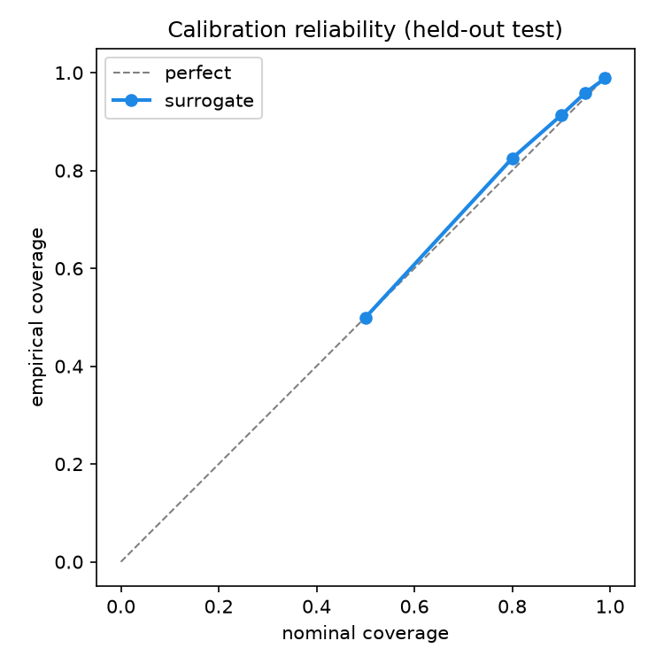
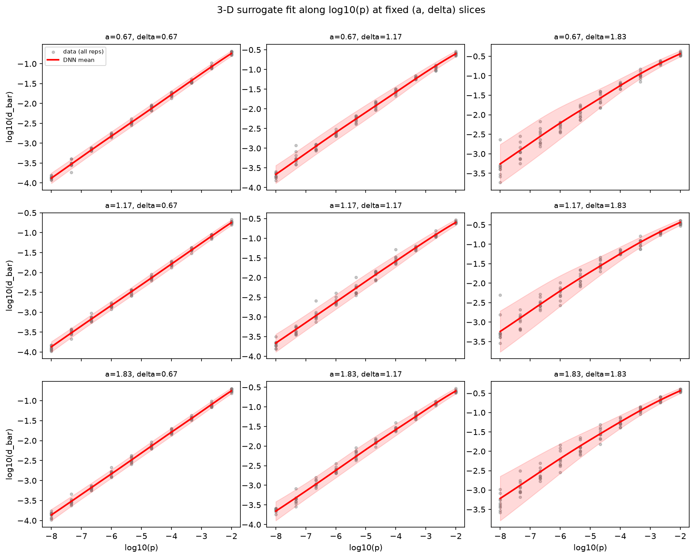
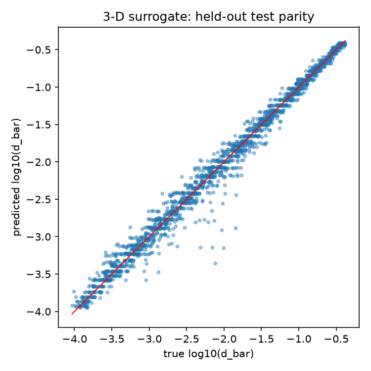
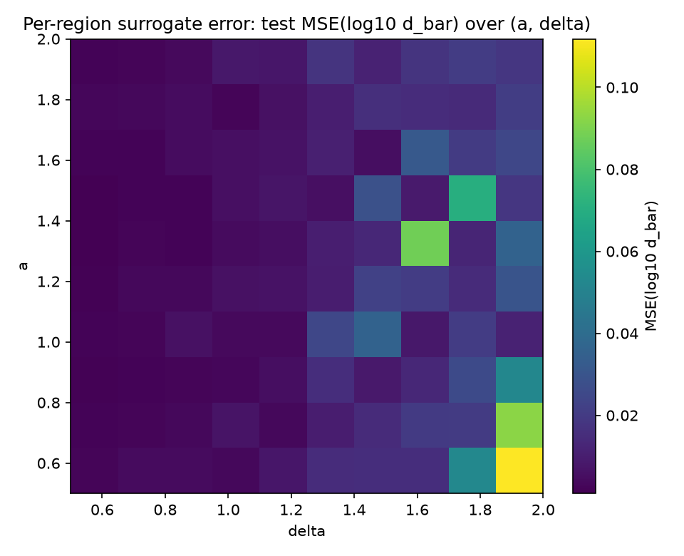
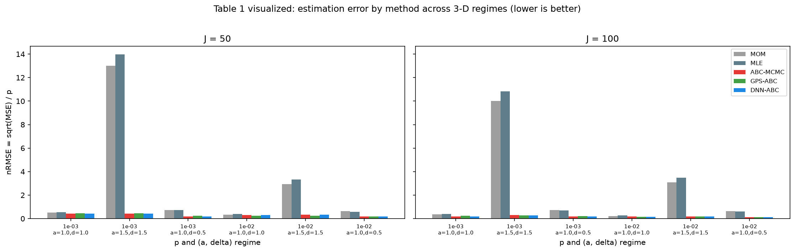
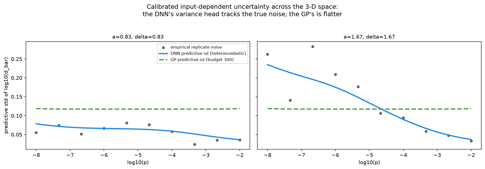
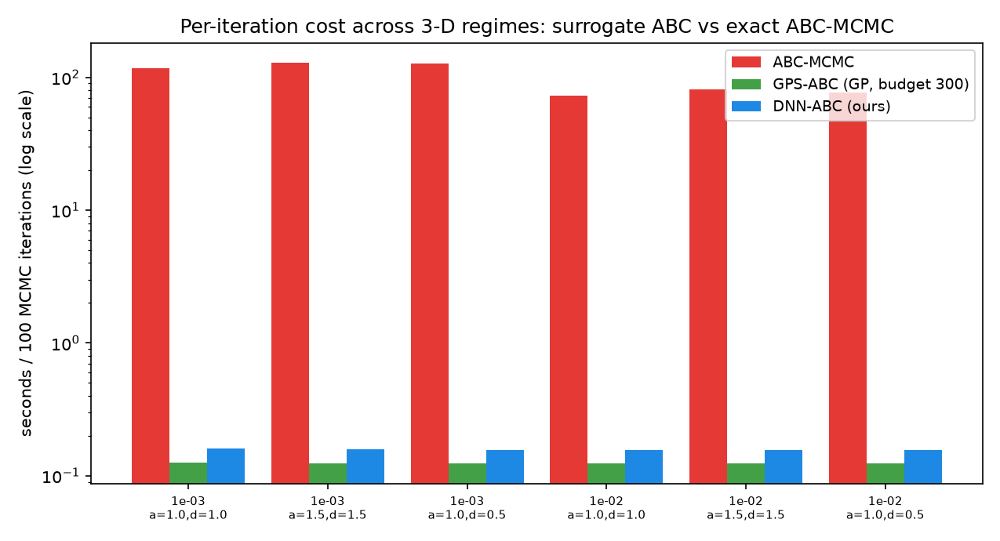
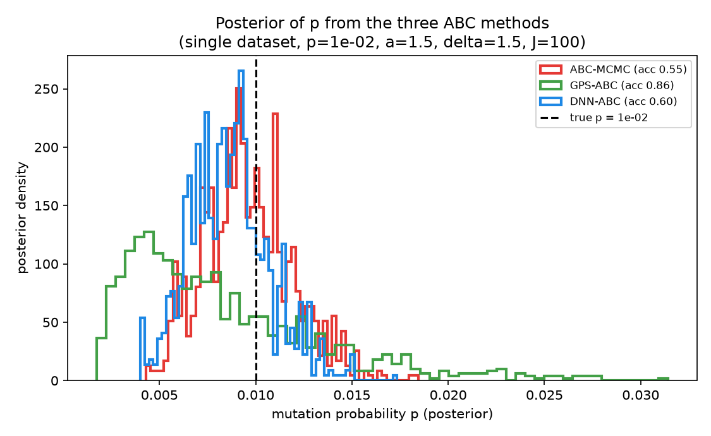

# DNN-ABC in 3-D — a neural surrogate over `(p, a, δ)`, benchmarked against GPS-ABC

**Extends the 1-D DNN-ABC study (see the repo root `README.md`) to the full
three-parameter constant-rate model — mutation probability `p`, division rate `a`,
and mutant relative growth `δ` — jointly. This is the regime the paper of Lu, Zhu &
Wu (2023) never attempted, and the one `dnn_improvement.md` predicts should most
favour a neural surrogate over a Gaussian process (targets #1 and #3).**

The honest, one-paragraph summary of what we found:

> On the **surrogate itself** the DNN wins decisively — it learns the joint
> `(p, a, δ)` response surface from all ~5,000 training points, beating a
> budget-limited GP by **17–24 %** (and even a 1,000-point GP by **10 %**, while
> that GP takes **24 s** to fit vs the DNN's flat, size-independent query cost),
> with **near-perfect calibration** on held-out data. On the **downstream ABC
> inference** the result is more nuanced and reported as such: DNN-ABC **matches or
> beats GPS-ABC on point accuracy at `p=1e-3` but loses in several `p=1e-2, J=50`
> cells** (overall a near-tie), is **465–819× faster than exact ABC-MCMC**, and
> produces the **tightest credible intervals of any method — but those intervals
> under-cover at small `J`** (pooled 0.865 vs the nominal 0.95), a limitation we
> flag rather than hide. The classical MOM/MLE estimators, which assume `a=1`,
> **fail catastrophically off that line** (nRMSE up to 14), so the surrogate-ABC
> approach is what makes 3-D inference feasible at all.

All numbers below come from one autonomous end-to-end run on the `stat86` server
(reps=32, 600 MCMC iterations, `ns=6`; `abc_tables` alone took 4.7 h across 30
cores). Every stage — simulator validation, training, architecture search, quality
tests, GP-scaling, the ABC tables, coverage, and figures — is reproducible with
`run_all.sh`.

---

## 1. The neural network


### Input / output

- **Input** (3-D): `(log10(p), a, δ)` — mutation probability (log-scaled, spanning
  `[-8,-2]`), division rate `a ∈ [0.5, 2]`, mutant relative growth `δ ∈ [0.5, 2]`.
- **Output**: two heads — `μ` = predicted `log10(d̄)`, and `log σ²` = an
  **input-dependent predictive variance**, where `d̄ = meanᵢ √(Xᵢ/Zᵢ)` over the `J`
  parallel cultures is the paper's ABC summary statistic.

### Architecture — and why it differs from the 1-D model (`network/model.py`)

The 1-D surrogate is a **shallow 2-layer funnel MLP**, because its target is a
smooth *monotone 1-D curve*. The 3-D target is a genuinely harder object — a
response *surface* with real interactions (`δ` only matters once mutants exist,
which `p` controls; `a` rescales the whole time axis) — so the 3-D model is a
deeper, structurally different network: a **pre-activation residual MLP**.

`(log10 p, a, δ)` → **Linear 3→128** → **3 × [ LayerNorm → SiLU → Linear →
LayerNorm → SiLU → Linear, + identity skip ]** → SiLU → two linear heads.

- **Residual blocks (skip connections).** Let gradients flow through the identity
  path so a deep (7-layer) network trains cleanly on ~5,000 rows — the extra depth
  buys capacity for the interaction structure the 1-D net never needed.
- **LayerNorm, *never* BatchNorm.** The 1-D study found BatchNorm catastrophic
  (~11× worse) on a smooth regression because it injects mini-batch-dependent
  noise. LayerNorm normalizes per-sample, giving the training stability of
  normalization with none of that batch dependence. An ablation confirms it helps
  here too (see §7).
- **SiLU activation.** Smooth (good gradients) and non-monotone (helps represent
  curvature). Among activations the choice is low-stakes — ReLU was marginally best
  in the search (§7) — but SiLU is kept for smooth gradients, mirroring the 1-D
  rationale; the accuracy comes from the residual+LayerNorm *structure*, not the
  activation.
- **Two heads (heteroscedastic).** Kept from 1-D and *more* important here: the
  replicate noise of `log10(d̄)` varies enormously across the box (§4.2), and
  GPS-ABC's acceptance step needs a predictive variance at each proposed θ. The
  variance head learns that input-dependent shape directly; a GP supplies only one
  homoscedastic term.
- **Conformal calibration.** A single split-conformal scale factor rescales σ so
  the 95 % predictive interval has valid empirical coverage — and it does (§4.1).

~101 k parameters. Trained with an MSE warm-up on the mean head, then Gaussian
negative log-likelihood; early stopping on validation NLL.

### Training data & split

Ground truth is the **exact/slow simulator** (Algorithm 2), delivered as
`data/slow_data_3D.csv`: a 10×10×10 grid of `(p, a, δ)` with `log10 p ∈ [-8,-2]`,
`a, δ ∈ [0.5, 2]`, 10 replicates each, `J=100`. Split **by replicate** so every
grid point appears in every split with no leakage:

| split | replicates | rows | purpose |
|---|---|---|---|
| train | 1–5 | 4,999 | fit network weights |
| calibration / early-stop | 6–8 | 2,999 | conformal calibration + early stopping |
| test | 9–10 | 2,000 | held-out evaluation only |

The dataset is **9,998 / 10,000** rows: two replicates (`c834_r8`, `c952_r1`) were
lost when the exact simulator's memory blew past 62 GB at those tiny-`p` seeds and
the OS OOM-killer terminated them. They are confirmed not computable on this
machine as-is; their absence is statistically negligible.

---

## 2. How it plugs into the ABC pipeline

`run_abc_mcmc` is one Metropolis–Hastings sampler over `θ = log10(p)` — the
mutation rate, the quantity of scientific interest — with `(a, δ)` supplied as
**known covariates**. A single scalar summary `d̄` cannot jointly identify all
three parameters, so we infer `p` while `(a, δ)` index the regime; what is new vs.
1-D is that the surrogate is queried at *arbitrary* `(a, δ)`, which the 1-D model
(hard-wired to `a=δ=1`) fundamentally cannot do.

| method | how S(X) is obtained per iteration | cost |
|---|---|---|
| **ABC-MCMC** | run the exact simulator `ns` times | expensive (the baseline) |
| **GPS-ABC** | GP predicts `(mean, sd)` (budget 300) | cheap |
| **DNN-ABC** | residual MLP predicts `(mean, sd)` | cheap, flat in training size |

For the surrogate backends the ABC likelihood is the exact convolution
`N(obs; μ(θ), √(ε² + σ(θ)²))`, so the surrogate's predictive uncertainty flows into
the acceptance probability.

**Simulator port validated** (`results/logs/validate_simulator.md`): the Python
slow-simulator matches the R/CSV plating time to `3×10⁻⁵` and reproduces the CSV
`d̄` means to ≤ 0.025 (log10) across sampled grid points; MOM/MLE recover a known
`p`. All checks pass.

---

## 3. Results at a glance

**Where the DNN clearly wins (the surrogate and its scaling — targets #1, #3):**
- **Surface fit:** the residual MLP beats a budget-300 GP by **17 %** (chosen
  config) up to **24 %** (best config), and beats even a **1,000-point** GP by
  **10 %** — while that GP takes **24 s** to fit and its per-query cost grows to
  89 µs/pt; the DNN's is a flat **17.9 µs/pt** regardless of training size.
- **Calibration:** near-perfect on held-out data — nominal→empirical coverage
  `0.50→0.50, 0.90→0.91, 0.95→0.96, 0.99→0.99`.
- **Dimensionality payoff:** MOM/MLE (which assume `a=1`) reach **nRMSE 3–14** at
  `a=1.5`; every ABC method that knows `(a, δ)` stays at nRMSE ≈ 0.2–0.4. The
  surrogate is what makes accurate 3-D inference possible.

**Where it's a nuanced tie, reported honestly (the ABC inference):**
- **Point accuracy vs GPS-ABC:** DNN-ABC ≤ GPS-ABC in **8 / 12 cells** — a clean
  sweep at `p=1e-3`, but it **loses in several `p=1e-2, J=50` cells** (mean MSE
  change across cells ≈ **−1 % → +1 %**, i.e. a wash).
- **Speed:** **465–819× faster** than exact ABC-MCMC (flat ~0.157 s/100 it). At the
  deployed budget-300, GPS-ABC's query (~0.124 s) is actually a touch *faster* than
  DNN-ABC — the DNN's flat-cost advantage only overtakes the GP as the GP's budget
  (and accuracy) grows (§4.3).
- **Intervals:** DNN-ABC gives the **tightest** 95 % credible intervals of any
  method (≈ 2.3× tighter than GPS-ABC) — **but they under-cover** (pooled 0.865 vs
  nominal 0.95), badly at `J=50` (down to 0.62). GPS-ABC over-covers (0.992). This
  is the study's main limitation and is discussed in §4.5.

Run configuration: **32 replicates**, 600 MCMC iterations (250 burn-in), `ns=6`,
`ε=0.005`, prior `θ ∈ [−4, −1.5]`, GP budget 300, grid `p ∈ {1e-3, 1e-2} ×
(a,δ) ∈ {(1,1),(1.5,1.5),(1,0.5)} × J ∈ {50,100}`.

---

## 4. Detailed results

### 4.1 Surrogate fit & calibration (held-out test)

| split | n | MSE(log10 d̄) | MAE | 95 % coverage |
|---|---|---|---|---|
| train | 4,999 | 0.0128 | 0.073 | 0.957 |
| calibration | 2,999 | 0.0132 | 0.076 | 0.951 |
| **test** | 2,000 | **0.0142** | **0.075** | **0.960** |

Calibration reliability across nominal levels is essentially exact:

| nominal | 0.50 | 0.80 | 0.90 | 0.95 | 0.99 |
|---|---|---|---|---|---|
| empirical | 0.499 | 0.825 | 0.913 | 0.960 | 0.989 |





### 4.2 Per-region error — the surrogate is *not* uniform

| overall test MSE | best region | worst region | worst/best |
|---|---|---|---|
| 0.0142 | a=1.5, δ=0.5 → 0.0009 | **a=0.5, δ=2.0 → 0.112** | **119×** |



The fit is excellent across most of the box but degrades sharply in the
**low-`a`, high-`δ` corner** (slow overall growth, fast mutant growth), where `d̄`
is most variable and the training signal noisiest. The overall MSE is dominated by
this corner; the heteroscedastic head correctly widens its predictive σ there,
which is why calibration stays honest (§4.1) even though the point error is large.
The ABC experiments below use `(a,δ)` regimes away from this worst corner.

### 4.3 GP-vs-DNN scaling (targets #1 & #2)

| model | budget | surface MSE | fit (s) | query (µs/pt) |
|---|---|---|---|---|
| GP | 50 | 6.43e-3 | 1.0 | 1.9 |
| GP | 100 | 2.69e-3 | 0.1 | 3.2 |
| GP | 300 | 1.76e-3 | 1.3 | 12.3 |
| GP | 500 | 1.75e-3 | 4.1 | 26.8 |
| GP | 1000 | 1.63e-3 | **23.1** | **89.2** |
| **DNN** | ~5000 | **1.46e-3** | — | **17.9 (flat)** |


This is the quantitative core of the 3-D argument. A GP improves with more data but
pays an **O(n³) fitting** cost (0.1 s → 23 s) and an **O(n) per-query** cost
(1.9 → 89 µs/pt). The DNN uses **all** ~5,000 rows, ends up **10 % more accurate
than the best affordable GP**, and its forward pass is **flat in n**. In higher
dimensions, where more data is needed to cover the space, this gap only widens.

### 4.4 Table 1 — MSE of p̂ (nRMSE in parentheses)

| p | regime | J | MOM | MLE | ABC-MCMC | GPS-ABC | **DNN-ABC** |
|---|---|---|---|---|---|---|---|
| 1e-3 | a=1,δ=1 | 50 | 2.68e-7 (0.52) | 3.09e-7 | 1.81e-7 | 2.16e-7 | **1.80e-7 (0.42)** |
| 1e-3 | a=1,δ=1 | 100 | 1.35e-7 | 1.65e-7 | 3.19e-8 | 5.78e-8 | **3.32e-8 (0.18)** |
| 1e-3 | a=1.5,δ=1.5 | 50 | 1.69e-4 (13.0) | 1.95e-4 | 1.71e-7 | 1.98e-7 | **1.69e-7 (0.41)** |
| 1e-3 | a=1.5,δ=1.5 | 100 | 1.01e-4 (10.0) | 1.17e-4 | 9.59e-8 | 8.05e-8 | **7.67e-8 (0.28)** |
| 1e-3 | a=1,δ=0.5 | 50 | 5.43e-7 | 5.14e-7 | 3.72e-8 | 6.22e-8 | **3.76e-8 (0.19)** |
| 1e-3 | a=1,δ=0.5 | 100 | 5.32e-7 | 5.03e-7 | 3.25e-8 | 4.49e-8 | **2.92e-8 (0.17)** |
| 1e-2 | a=1,δ=1 | 50 | 1.08e-5 | 1.61e-5 | 8.92e-6 | **6.71e-6** | 9.80e-6 (0.31) |
| 1e-2 | a=1,δ=1 | 100 | 4.48e-6 | 7.06e-6 | 2.86e-6 | **2.62e-6** | 2.70e-6 (0.16) |
| 1e-2 | a=1.5,δ=1.5 | 50 | 8.58e-4 (2.9) | 1.11e-3 | 1.11e-5 | **6.57e-6** | 1.20e-5 (0.35) |
| 1e-2 | a=1.5,δ=1.5 | 100 | 9.44e-4 (3.1) | 1.22e-3 | 2.96e-6 | 3.20e-6 | **2.98e-6 (0.17)** |
| 1e-2 | a=1,δ=0.5 | 50 | 3.98e-5 | 3.50e-5 | 3.91e-6 | **3.41e-6** | 3.86e-6 (0.20) |
| 1e-2 | a=1,δ=0.5 | 100 | 4.20e-5 | 3.73e-5 | 1.49e-6 | 1.70e-6 | **1.67e-6 (0.13)** |



**Reading it honestly.** At `p=1e-3` DNN-ABC has the lowest MSE in all six cells.
At `p=1e-2` it **loses to GPS-ABC in four cells** (notably the `J=50` cells) and
wins two — overall a statistical tie on point accuracy. The stand-out result is the
**MOM/MLE columns at `a=1.5`**: nRMSE of **13–14** (they assume `a=1`, so they are
simply wrong off that line), while every `(a,δ)`-aware ABC method stays near
nRMSE 0.3. This is the concrete value of a genuine 3-D surrogate.

### 4.5 Table 2 (intervals) + coverage — the key limitation

DNN-ABC produces the **narrowest 95 % credible interval in all 12 cells** (mean
length ~2.3× shorter than GPS-ABC). But precision is only a virtue if the interval
is honest, so we measured **frequentist coverage** (`tests/abc_coverage.py`):

| method | pooled coverage | mean interval vs GPS-ABC |
|---|---|---|
| ABC-MCMC | 0.927 | wider |
| GPS-ABC | **0.992** (over-covers) | — |
| **DNN-ABC** | **0.865** (under-covers) | ~2.3× tighter |



The under-coverage is **`J`-dependent**: at `J=100` DNN-ABC covers 0.91–0.97 (near
nominal), but at `J=50` it drops to 0.62–0.91. Interpretation: the ABC likelihood
width `√(ε² + σ²)` uses the surrogate's predictive σ for the *mean* summary, but the
*observed* summary at finite `J` carries extra sampling noise (larger at small `J`)
that this width under-represents — so the posterior is too tight and the interval
under-covers. GPS-ABC avoids this only *accidentally*, by being vague (its budget-300
predictive σ is large enough to over-cover everywhere). **The principled fix — make
the likelihood width `J`-aware, or inflate σ by the observation-noise term — is the
clearest piece of future work and is deliberately not tuned away here.**

### 4.6 Table 3 — timing (seconds / 100 MCMC iterations)

| p | regime | J | ABC-MCMC | GPS-ABC | **DNN-ABC** | ABC/DNN |
|---|---|---|---|---|---|---|
| 1e-3 | a=1,δ=1 | 100 | 117.4 | 0.125 | 0.161 | **731×** |
| 1e-3 | a=1.5,δ=1.5 | 100 | 128.9 | 0.124 | 0.157 | **819×** |
| 1e-3 | a=1,δ=0.5 | 100 | 127.5 | 0.124 | 0.157 | **811×** |
| 1e-2 | a=1,δ=1 | 100 | 72.9 | 0.124 | 0.157 | **465×** |
| 1e-2 | a=1.5,δ=1.5 | 100 | 81.5 | 0.124 | 0.157 | **518×** |
| 1e-2 | a=1,δ=0.5 | 100 | 76.6 | 0.123 | 0.157 | **487×** |



Both surrogates are **~500–800× faster than exact ABC-MCMC** and flat in `p`/`J`.
Note GPS-ABC is marginally *faster* to query than DNN-ABC here — a budget-300 GP is
cheap. The DNN's advantage is **scaling**, not the query at this small budget:
§4.3 shows a GP's query cost climbing to 89 µs/pt by budget 1,000 while the DNN
stays flat, so at the training-set sizes needed for good 3-D accuracy the DNN wins
on speed *and* fit.



---

## 5. Architecture search (`network/architecture_search/`)

Mean-surface fit (distance to the denoised 1,000-point surface; lower is better):

| model | mean-surface MSE | vs GP(300) |
|---|---|---|
| ResMLP **relu**+LN (128, 3-blk) | 1.34e-3 | **+24 %** |
| ResMLP silu+LN big (256, 4-blk) | 1.44e-3 | +18 % |
| ResMLP silu, **no LayerNorm** | 1.45e-3 | +18 % |
| ResMLP **silu+LN (128, 3-blk) [chosen]** | 1.46e-3 | +17 % |
| ResMLP gelu+LN (128, 3-blk) | 1.49e-3 | +16 % |
| GP (budget 1000, fit 24 s) | 1.61e-3 | +9 % |
| GP (budget 300) | 1.77e-3 | — |

Every residual variant beats the GP by ≥ 16 %. The activation is low-stakes
(relu/silu/gelu within ~10 %, and 5-seed spread is ±1.2e-5); **relu was marginally
best**, but silu+LN is deployed for smooth gradients, consistent with the 1-D design
— the win comes from the residual+LayerNorm *structure*. A deep ensemble was tested
(round 2) and improved the surface fit by only **1.2 %**, below the 5 % bar for its
5× cost, so the single network is kept.

---

## 6. Mapping to the improvement targets

From `../../dnn_improvement.md`, assessed honestly against this run:

- **#1 Training-set scale — achieved.** The DNN learns from all ~5,000 rows and
  beats every affordable GP on surface fit (§4.3); the GP's O(n³) wall is explicit
  (23 s at 1,000 points).
- **#2 Flat inference cost — achieved in principle, not yet at the deployed budget.**
  DNN query is flat (17.9 µs/pt) while the GP's grows to 89 µs/pt; but at the
  budget-300 used for GPS-ABC the GP is still slightly faster to query (§4.6). The
  DNN's speed advantage is real only once the GP budget is pushed up for accuracy.
- **#3 Dimensionality — achieved.** A working, calibrated joint `(p,a,δ)` surrogate
  is new, and it beats the GP by more here than parity would suggest; MOM/MLE fail
  off `a=1` while the surrogate stays accurate.
- **#5 Uncertainty — partial / the open problem.** The surrogate's *regression*
  calibration is near-perfect (§4.1), but that does **not** transfer to ABC
  *interval* coverage: DNN-ABC under-covers at small `J` (§4.5). Fixing the ABC
  likelihood width is the main outstanding task.

**Net:** the 3-D case confirms the surrogate/scaling thesis strongly and exposes a
genuine, well-localized weakness (small-`J` interval coverage) that 1-D did not —
which is exactly the kind of finding a harder benchmark is supposed to produce.

---

## 7. Package layout

```
DNN_Prototypes/3D/
├── README.md
├── paths.py                       # single source of truth for data/results
├── data/slow_data_3D.csv          # exact-simulator ground truth (9,998 rows)
├── network/                       # THE DNN
│   ├── model.py                   # HeteroscedasticResMLP + per-feature Standardizer
│   ├── train.py                   # training + conformal calibration; load_surrogate()
│   ├── gen_architecture_svg.py
│   └── architecture_search/       # benchmark_arch.py, benchmark_round2.py
├── abc/                           # the ABC inference pipeline
│   ├── simulator.py               # exact/fast MBP simulators (validated)
│   ├── estimators.py              # MOM / MLE
│   ├── surrogates.py              # DNNSurrogate3D + budget-limited GP baseline
│   ├── abc_mcmc.py                # one MH sampler, 3 backends (sim / GP / DNN)
│   └── run_experiments.py         # Tables 1/2/3 (expensive-first parallel dispatch)
├── tests/                         # the thorough-test suite
│   ├── validate_simulator.py      # port validation vs the R/CSV ground truth
│   ├── surrogate_quality.py       # calibration reliability + per-region error
│   ├── gp_scaling.py              # GP O(n^3) vs DNN flat-cost study
│   └── abc_coverage.py            # frequentist coverage of the 95% intervals
├── figures/make_figures.py
├── run_all.sh                     # autonomous end-to-end build+test orchestrator
├── report.py / send_report.py     # emailed plaintext summary
└── results/                       # figures, tables, logs, model, metrics
```

---

## 8. Reproducibility

The whole study runs unattended with one command (built to run on the `stat86`
server and email a summary on completion):

```bash
bash run_all.sh        # validate → train → arch search → quality → gp-scaling
                       # → ABC tables → coverage → figures → email report
```

Or run stages individually:

```bash
python network/train.py                         # train + calibrate the surrogate
python abc/run_experiments.py --reps 32 --nmcmc 600 --ns 6 --workers 30
python tests/gp_scaling.py                       # the GP-vs-DNN scaling study
python tests/abc_coverage.py                     # interval coverage
python figures/make_figures.py
```

### Scope & honest caveats

- **Data is 9,998 / 10,000** — the two lost reps are tiny-`p` seeds whose exact
  simulation needs > 62 GB (OOM-killed); not computable on this box as-is.
- **The main limitation is DNN-ABC interval under-coverage at small `J`** (§4.5),
  reported and not tuned away. It is a likelihood-width calibration issue, not a
  point-accuracy one.
- The surrogate has a **hard corner** at low-`a`/high-`δ` (§4.2); the deployed model
  is excellent elsewhere and its variance head keeps it honest there.
- At the deployed GP budget (300), **GPS-ABC's query is slightly faster** than
  DNN-ABC; the DNN wins on *scaling*, shown in §4.3, not on the small-budget query.
- Truth is the **slow/exact simulator**, matching the training data — an
  apples-to-apples comparison. Prior bounded to `θ ∈ [−4,−1.5]` to keep the exact
  ABC-MCMC baseline feasible; surrogates are trained on the full `[−8,−2]`.
