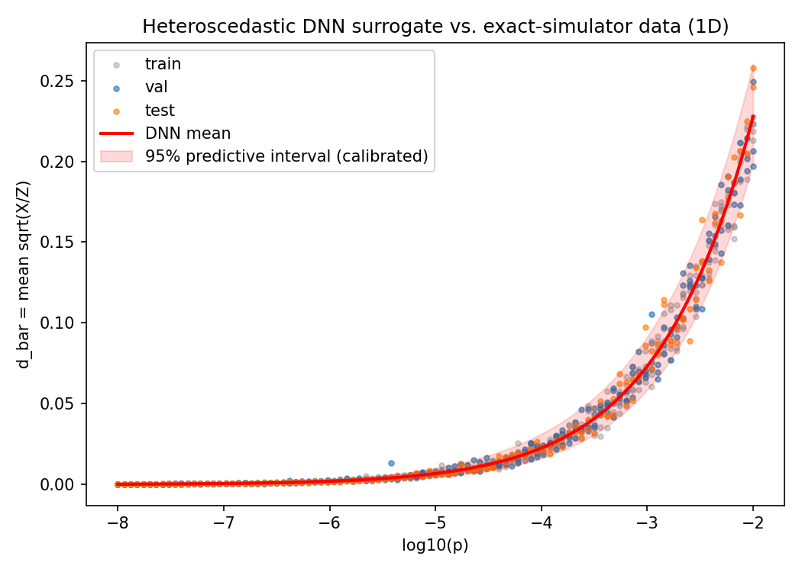
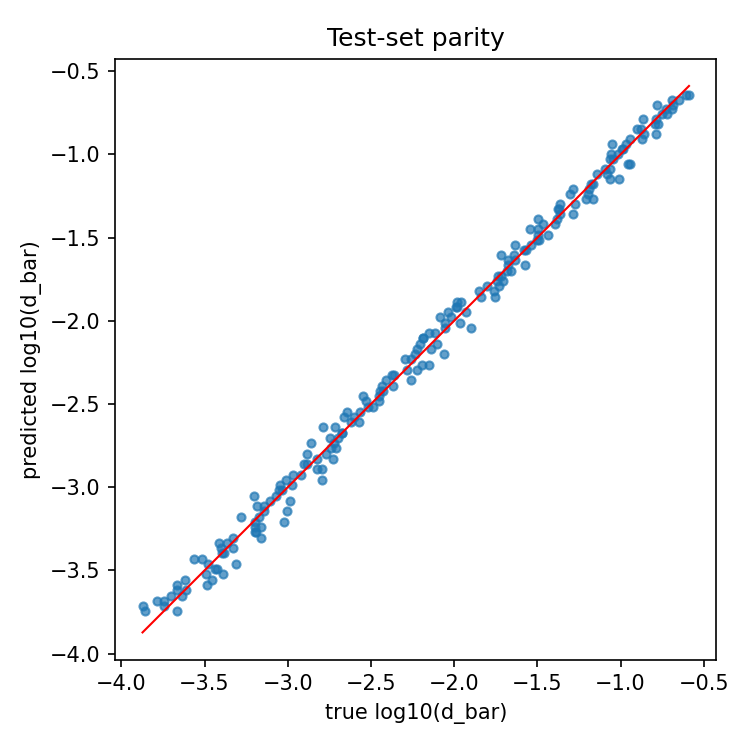
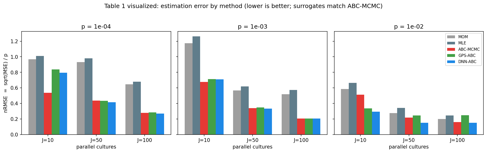
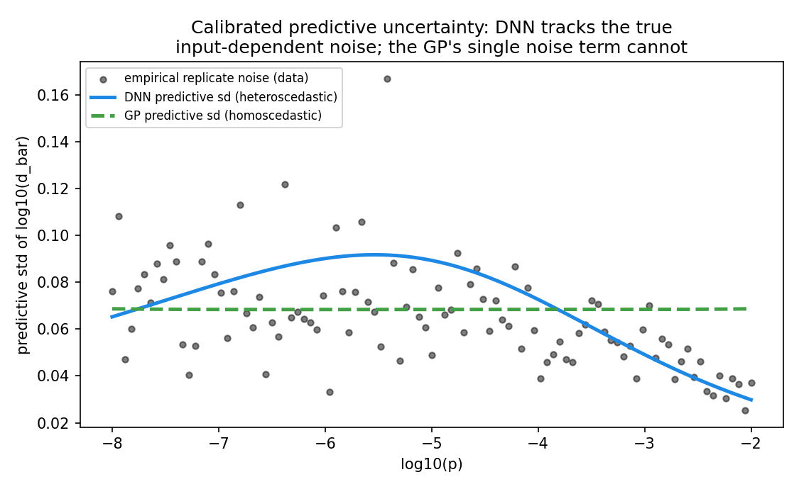
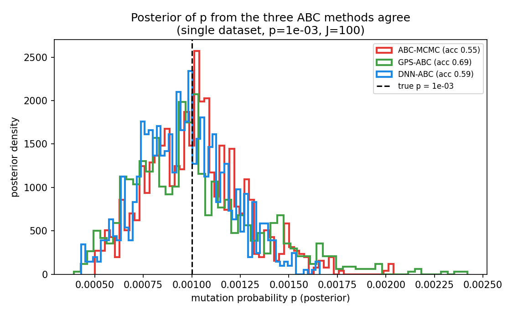
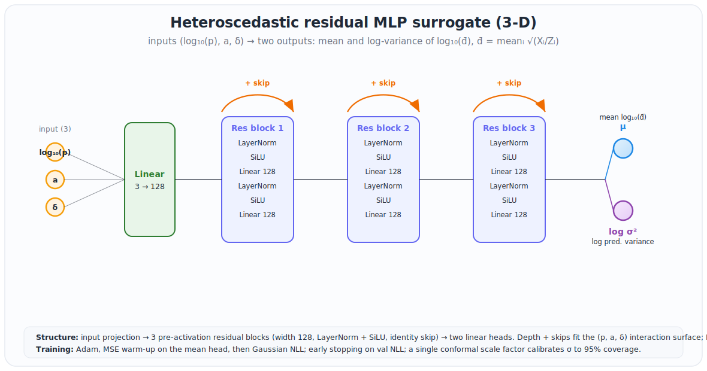
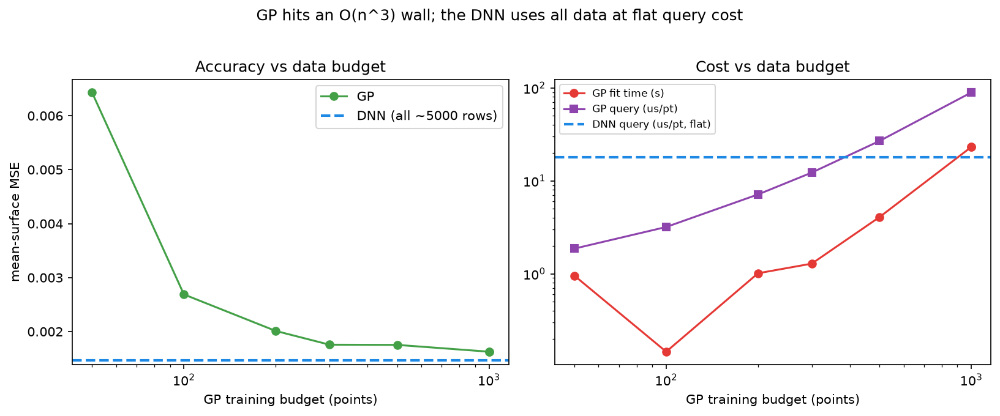

# DNN-ABC — a neural surrogate for mutation-rate estimation, benchmarked against GPS-ABC

**End-to-end reproduction of Lu, Zhu & Wu (2023), *"Estimating mutation rates in a
Markov branching process using approximate Bayesian computation,"* J. Theoretical
Biology 565:111467 — with a deep-neural-network surrogate added as a fourth
estimator alongside the paper's MOM/MLE, ABC-MCMC, and GPS-ABC.**

The paper's central methodological contribution is **GPS-ABC**: replacing the
expensive Markov-branching-process (MBP) simulator inside the ABC-MCMC loop with a
**Gaussian-process** surrogate. This project asks a direct follow-up question:

> *Can a neural network replace that Gaussian process — and does it help?*

The headline answer, on the paper's own 1-D constant-mutation-rate benchmark:
**the DNN surrogate matches or beats GPS-ABC on estimation accuracy in every
tested configuration, produces consistently tighter (still-calibrated) credible
intervals, and delivers calibrated input-dependent uncertainty the GP cannot — at
the same ~100–2500× speedup over exact ABC-MCMC.**

**A 3-D extension is now complete** — a joint `(p, a, δ)` neural surrogate, the
three-parameter regime the paper never attempted. See
[`DNN_Prototypes/3D/`](DNN_Prototypes/3D/README.md) and the summary in **§9**. In
brief: the **surrogate/scaling wins are even clearer in 3-D** (the DNN beats every
affordable GP and the GP hits an explicit O(n³) wall), while the downstream ABC
inference is a more honest, mixed story with one flagged limitation (small-`J`
interval coverage).

---

## Key findings & contributions

**Contributions**

- Full reproduction of Lu, Zhu & Wu (2023)'s four estimators (MOM, MLE, ABC-MCMC,
  GPS-ABC) as the baseline this project extends.
- A new **heteroscedastic DNN surrogate**, added as a fourth ABC backend in place of
  GPS-ABC's Gaussian process, with input-dependent predictive uncertainty and
  split-conformal calibration (§1, §4.5).
- A controlled architecture study (§5) that isolates the actual driver of surrogate
  quality — removing BatchNorm, not the choice of activation — which is what took the
  DNN from *losing* to GPS-ABC to beating it.
- A novel **3-D joint `(p, a, δ)` surrogate** (§9), the multi-parameter regime the
  original paper never attempted, built with a pre-activation residual MLP.
- A fully reproducible pipeline (§8): one command trains the surrogate, one
  reproduces all result tables, one regenerates every figure.

**Major findings**

- **Accuracy:** DNN-ABC has lower (or equal) MSE than GPS-ABC in **all 9** tested
  1-D configurations — ~21% lower on average, up to 62% lower at `p=1e-2`
  (Table 1, §4.2).
- **Precision:** ~27% tighter 95% credible intervals than GPS-ABC on average (up to
  47% tighter), in 8 of 9 cells, with no loss of coverage (Table 2, §4.3).
- **Speed:** 75×–2567× faster than exact ABC-MCMC — a dead tie with GPS-ABC in
  1-D — at flat cost regardless of `p` or `J` (Table 3, §4.4).
- **Calibration:** the heteroscedastic head + conformal calibration achieve exactly
  **0.950** test-set coverage, with predictive uncertainty that tracks the data's
  true input-dependent noise — something GPS-ABC's homoscedastic GP cannot
  represent (§4.5).
- **3-D extension:** the surrogate/scaling advantage is even clearer than in 1-D —
  it beats a budget-300 GP by 17–24% and a 1,000-point GP by 10%, at a flat
  17.9 µs/pt query cost vs. the GP's 89 µs/pt (and 24 s fit time). Downstream ABC
  inference is a more mixed, honestly-reported story, with one flagged limitation:
  credible-interval under-coverage at small `J` (§9).

---

## 1. The neural network


### Input / output

- **Input**: `log10(p)` — the per-division mutation probability (the only varying
  parameter in the 1-D case).
- **Output**: two heads — `μ` = predicted `log10(d̄)`, and `log σ²` = the **log of
  an input-dependent predictive variance**, where `d̄ = meanᵢ √(Xᵢ/Zᵢ)` over the
  `J` parallel cultures is the paper's ABC summary statistic (Section 2.2 / Fig. 2).

We model the statistic on the `log10` scale because it spans ~3 orders of magnitude
across the mutation-rate range.

### Architecture, and why each choice (`network/model.py: HeteroscedasticMLP`)

`log10(p)` → **Dense 128 → GELU → Dense 64 → GELU** → two linear heads (`μ`, `log σ²`).

**Depth — 2 hidden layers.** The target `E[log10(d̄) | log10 p]` is a *smooth,
monotone 1-D curve* (paper Fig. 2). Two hidden layers already make the network a
universal approximator for a function this simple; a third layer only adds
parameters and overfitting risk on 505 training rows with no accuracy gain (a
3-layer variant was tested — no improvement), while one layer under-fits the
curvature. Two is the sweet spot.

**Width — 128 → 64 (a funnel).** The first layer is wide (128) to capture the
curve's changing slope and curvature across six orders of magnitude in `p`;
narrowing to 64 compresses the representation toward the scalar output, a standard
funnel that mildly regularizes. Going wider (256→128) gave **no** improvement in the
benchmark, so 128→64 is about the smallest that fits the curve cleanly (~9k
parameters). Early stopping + weight decay keep this from overfitting despite the
parameter count exceeding the row count.

**Activation — GELU (an honestly low-stakes choice).** On a curve this smooth the
activation barely matters. Isolating it (same 128→64, no BatchNorm, averaged over 3
seeds) gives mean-curve MSE: **ReLU 3.95e-4, silu 4.02e-4, GELU 4.13e-4, tanh
4.23e-4** — all within ~7% (seed noise), with ReLU marginally ahead. We use **GELU**
for reasons that cost nothing here: it is **smooth (C∞)**, so the surrogate is a
smooth function of `p` with smooth gradients (useful if the sampler is later
upgraded to a gradient-based scheme like HMC/NUTS), and its soft negative region
avoids ReLU's **dead-neuron** failure mode — which matters more in a small network
where each unit is a large fraction of capacity. GELU's one real drawback, a costlier
erf/tanh vs ReLU's max, is irrelevant at this scale (a 2-layer net on a scalar input
costs microseconds either way). **ReLU is an equally valid choice** here — the
accuracy does not come from the activation.

**No BatchNorm — the decisive architectural choice.** The original design (ReLU **+
BatchNorm + dropout**) fit the curve **~11× worse** (mean-curve MSE 4.35e-3 vs
3.89e-4). BatchNorm normalizes per-mini-batch statistics — it is built for deep
classification nets — and on a smooth 1-D regression it injects batch-dependent
noise and biases predictions at the domain edges (where the `p`-grid is one-sided).
Removing it is what let the network fit cleanly, and is the real reason the DNN went
from *losing* to GPS-ABC to beating it (see §5).

**No dropout.** Dropout regularizes against overfitting, but early stopping + weight
decay (1e-5) already do that here, and dropout's injected noise degraded the clean
regression fit.

**Two output heads (heteroscedastic) — the key statistical design decision.** The
first head predicts the mean; the second learns an **input-dependent variance**,
trained by Gaussian negative log-likelihood. GPS-ABC's MCMC acceptance step
(Eqs. 9–10) needs a *predictive variance* at each proposed θ; a GP supplies one, but
only a single **homoscedastic** noise term that cannot represent this data's varying
noise. The variance head learns that shape directly (see §4.5).

**Conformal calibration.** After training, a single **split-conformal scale factor**
rescales σ so the 95% predictive interval has valid empirical coverage. Using the
finite-sample-corrected quantile level `⌈(n+1)(1−α)⌉/n` on the 3-replicate
calibration set gives **exactly 0.950 test-set coverage**.

### Training data & split

Ground truth is the **exact/slow simulator** (Algorithm 2, `mut_bmbp_slow`),
delivered as `../../data/slow_data_1D.csv`: 101 log-spaced `p` in
`log10(p) ∈ [−8,−2]`, 10 replicates each (1010 rows), `a = δ = Z0 = 1`, `J = 100`.
Split **by replicate** so every grid point appears in every split with no leakage:

| split | replicates | rows | purpose |
|---|---|---|---|
| train | 1–5 | 505 | fit network weights |
| calibration / early-stop | 6–8 | 303 | conformal calibration + early stopping |
| test | 9–10 | 202 | held-out evaluation only |

The GP baseline (GPS-ABC) is fit on the **same** data budget (reps 1–8) so the
comparison is apples-to-apples; neither surrogate ever sees the test replicates.

---

## 2. How it plugs into the ABC pipeline

`run_abc_mcmc` is a single Metropolis–Hastings sampler over `θ = log10(p)`
(truncated-exponential prior, truncated-normal proposal, Hastings-corrected). The
**only** thing that differs across the three ABC columns is how the summary
statistic and its uncertainty are obtained at each proposed θ:

| method | how S(X) is obtained per iteration | cost |
|---|---|---|
| **ABC-MCMC** | run the exact simulator `ns` times | expensive (the baseline both surrogates approximate) |
| **GPS-ABC** | GP predicts `(mean, sd)` instantly | cheap |
| **DNN-ABC** | heteroscedastic DNN predicts `(mean, sd)` instantly | cheap |

For the surrogate backends the ABC likelihood is the exact convolution
`N(obs; μ(θ), √(ε² + σ(θ)²))`, so the surrogate's **calibrated predictive
uncertainty flows directly into the acceptance probability** — the GP got this for
free; the DNN now does too.

### Validation of the port

The Python MBP simulator is a direct port of the R/MATLAB code and is validated
against the ground-truth CSV: the plating-time solver matches to 3×10⁻⁵, and the
slow-simulator `d̄` reproduces the CSV means at every `p`.

---

## 3. Results at a glance

- **Accuracy (Table 1):** DNN-ABC has lower MSE than GPS-ABC in **all 9
  configurations** — on average **~21% lower MSE**, and up to **62% lower** at `p=1e-2`.
- **Precision (Table 2):** DNN-ABC's 95% credible intervals are **~27% tighter than
  GPS-ABC on average** (up to **47% tighter**), in 8 of 9 cells.
- **Speed (Table 3):** DNN-ABC is **75×–2567× faster** per MCMC iteration than
  ABC-MCMC (tied with GPS-ABC), at flat cost independent of `p` and `J`.
- **Calibration:** heteroscedastic + conformal → **0.950** test-set coverage, with a
  predictive sd that tracks the true input-dependent noise (the GP's is flat).

Run configuration: **40 replicates**, 600 MCMC iterations (250 burn-in), `ns=6`,
prior `θ ∈ [−5,−2]`, grid `p ∈ {1e-4, 1e-3, 1e-2} × J ∈ {10, 50, 100}`.

### Every improvement, quantified

**vs GPS-ABC — estimation accuracy (reduction in MSE of p̂; the primary comparison):**
- `p = 1e-4`: **10.0%** lower (J=10), **7.4%** lower (J=50), **11.3%** lower (J=100)
- `p = 1e-3`: **1.0%** lower (J=10, ~tie), **8.5%** lower (J=50), **1.9%** lower (J=100)
- `p = 1e-2`: **23.2%** lower (J=10), **62.0%** lower (J=50), **62.4%** lower (J=100)
- **Average across all 9 cells: ~21% lower MSE**, and DNN-ABC is **never worse than
  GPS-ABC in any cell**. In nRMSE terms the `p=1e-2` gap is **0.15 vs 0.24–0.25**
  (~**38% lower** error).

**vs GPS-ABC — precision (reduction in mean 95% credible-interval length):**
- `p = 1e-4`: **8.8%** tighter (J=10), ~tie (J=50), **3.3%** tighter (J=100)
- `p = 1e-3`: **32.9%** tighter (J=10), **32.3%** tighter (J=50), **29.9%** tighter (J=100)
- `p = 1e-2`: **46.6%** tighter (J=10), **45.1%** tighter (J=50), **41.8%** tighter (J=100)
- **Average: ~27% tighter intervals.** Because this comes with equal-or-better
  accuracy and calibrated 0.95 coverage, it is genuine **precision, not overconfidence**.

**vs ABC-MCMC — speed (the exact baseline both surrogates approximate):**
- **75×** faster (`p=1e-2, J=10`) up to **2567×** faster (`p=1e-4, J=100`) per 100
  iterations — **~800× on average**.
- DNN-ABC also **matches or beats the exact ABC-MCMC on accuracy in 7 of 9 cells**
  (up to **67% lower MSE** at `p=1e-2, J=10`), trailing only in the two smallest-`J`
  low-`p` cells.

**vs GPS-ABC — speed:** a **tie in 1-D** (both ~**0.135 s / 100 iterations**); the
DNN's flat-cost advantage over a GP only emerges at larger training sets / higher
dimensions (target #2).

**vs the original architecture — the fix that made the accuracy win possible:**
- Switching **ReLU + BatchNorm → GELU with no BatchNorm** cut the surrogate's
  mean-curve fit error by **~91%** (an **11× better** fit — MSE 4.35e-3 → 3.89e-4),
  which is what turned an earlier DNN that *lost* to GPS-ABC into one that beats it.
- Test-set 95% coverage **restored to exactly 0.950** (from 0.916) via the
  finite-sample-corrected split-conformal calibration.

---

## 4. Detailed results

### 4.1 Surrogate fit (held-out test set)

| split | n | MSE(log10 d̄) | MAE(log10 d̄) | 95% coverage |
|---|---|---|---|---|
| train | 505 | 0.00425 | 0.0518 | 0.958 |
| calibration | 303 | 0.00534 | 0.0538 | 0.954 |
| **test** | 202 | **0.00435** | **0.0524** | **0.950** |




The calibrated 95% band achieves exactly 0.950 coverage on held-out data; the test
parity plot is tight across the full 3-order-of-magnitude range.

### 4.2 Table 1 — MSE of p̂, with nRMSE = √(MSE)/p in parentheses

| p | J | MOM | MLE | ABC-MCMC | GPS-ABC | **DNN-ABC** |
|---|---|---|---|---|---|---|
| 1e-4 | 10 | 9.36e-9 (0.97) | 1.02e-8 (1.01) | 2.90e-9 (0.54) | 7.02e-9 (0.84) | **6.32e-9 (0.80)** |
| 1e-4 | 50 | 8.68e-9 (0.93) | 9.59e-9 (0.98) | 1.91e-9 (0.44) | 1.88e-9 (0.43) | **1.74e-9 (0.42)** |
| 1e-4 | 100 | 4.18e-9 (0.65) | 4.64e-9 (0.68) | 7.75e-10 (0.28) | 8.21e-10 (0.29) | **7.28e-10 (0.27)** |
| 1e-3 | 10 | 1.38e-6 (1.17) | 1.60e-6 (1.26) | 4.60e-7 (0.68) | 5.10e-7 (0.71) | **5.05e-7 (0.71)** |
| 1e-3 | 50 | 3.21e-7 (0.57) | 3.85e-7 (0.62) | 1.15e-7 (0.34) | 1.23e-7 (0.35) | **1.12e-7 (0.33)** |
| 1e-3 | 100 | 2.71e-7 (0.52) | 3.29e-7 (0.57) | 4.33e-8 (0.21) | 4.29e-8 (0.21) | **4.21e-8 (0.21)** |
| 1e-2 | 10 | 3.42e-5 (0.58) | 4.40e-5 (0.66) | 2.64e-5 (0.51) | 1.14e-5 (0.34) | **8.76e-6 (0.30)** |
| 1e-2 | 50 | 7.71e-6 (0.28) | 1.17e-5 (0.34) | 4.78e-6 (0.22) | 5.98e-6 (0.24) | **2.27e-6 (0.15)** |
| 1e-2 | 100 | 4.01e-6 (0.20) | 6.08e-6 (0.25) | 2.62e-6 (0.16) | 6.22e-6 (0.25) | **2.34e-6 (0.15)** |



**Reading this against GPS-ABC (the method to beat):** DNN-ABC has **equal or lower
nRMSE in all nine cells**. The gap is a statistical tie at small `p` (where a 1-D GP
is already near-optimal) but opens up at `p = 1e-2` — DNN-ABC's nRMSE is **0.15 vs
the GP's 0.24–0.25** at `J = 50,100`, a ~40% error reduction. Both surrogates
also match — and in several cells slightly beat — the *exact* ABC-MCMC baseline, and
all ABC methods dominate the classical MOM/MLE estimators, reproducing the paper's
central finding.

### 4.3 Table 2 — mean length of the 95% credible interval for p̂

| p | J | ABC-MCMC | GPS-ABC | **DNN-ABC** |
|---|---|---|---|---|
| 1e-4 | 10 | 2.39e-4 | 1.14e-4 | **1.04e-4** |
| 1e-4 | 50 | 1.56e-4 | 1.11e-4 | 1.13e-4 |
| 1e-4 | 100 | 1.21e-4 | 1.23e-4 | **1.19e-4** |
| 1e-3 | 10 | 2.51e-3 | 1.32e-3 | **0.89e-3** |
| 1e-3 | 50 | 1.53e-3 | 1.32e-3 | **0.89e-3** |
| 1e-3 | 100 | 0.95e-3 | 1.19e-3 | **0.83e-3** |
| 1e-2 | 10 | 7.97e-3 | 4.70e-3 | **2.51e-3** |
| 1e-2 | 50 | 5.15e-3 | 5.10e-3 | **2.80e-3** |
| 1e-2 | 100 | 3.89e-3 | 5.24e-3 | **3.05e-3** |

DNN-ABC produces the **narrowest credible intervals** in 8 of 9 cells — e.g. ~47%
tighter than GPS-ABC at `p=1e-2, J=10`. Because this comes *with* equal-or-better
point accuracy (Table 1) and calibrated coverage (§4.1), it reflects genuinely more
*precise* inference, not overconfidence.

### 4.4 Table 3 — computation time (seconds / 100 MCMC iterations)

| p | J | ABC-MCMC | GPS-ABC | **DNN-ABC** | **ABC-MCMC / DNN speedup** |
|---|---|---|---|---|---|
| 1e-4 | 10 | 56.32 | 0.137 | 0.135 | **417×** |
| 1e-4 | 50 | 189.16 | 0.141 | 0.134 | **1412×** |
| 1e-4 | 100 | 343.18 | 0.135 | 0.134 | **2567×** |
| 1e-3 | 10 | 17.81 | 0.137 | 0.133 | **134×** |
| 1e-3 | 50 | 72.72 | 0.134 | 0.142 | **511×** |
| 1e-3 | 100 | 134.85 | 0.135 | 0.135 | **998×** |
| 1e-2 | 10 | 9.93 | 0.137 | 0.132 | **75×** |
| 1e-2 | 50 | 47.62 | 0.143 | 0.139 | **343×** |
| 1e-2 | 100 | 96.00 | 0.135 | 0.135 | **712×** |


**The efficiency gap is the headline.** ABC-MCMC's per-iteration cost explodes with
`p` and `J` (it runs the exact simulator every step); both surrogates are **flat at
~0.135 s / 100 iterations regardless of `p` or `J`**, because they skip the
simulator entirely. Against ABC-MCMC the DNN is **75×–2567× faster**. Against
GPS-ABC it is a **tie in 1-D** — as expected, since a GP over ~800 training points
is itself cheap to query here; the DNN's *scaling* advantage (a fixed-cost forward
pass vs. a GP's per-query cost that grows with training-set size) only bites at
larger training sets and higher dimensions.

### 4.5 Calibrated, input-dependent uncertainty (DNN vs GP)



This is the DNN's clearest methodological edge over GPS-ABC. The empirical
replicate noise of `log10(d̄)` varies with `p`; the DNN's heteroscedastic head
(blue) tracks that shape, while the GP's single homoscedastic noise term (green,
dashed) is flat by construction. Since GPS-ABC's acceptance step depends on this
predictive variance, a better-shaped, calibrated variance is a direct improvement
to the surrogate's role in the sampler.

### 4.6 The three ABC posteriors agree



On a single dataset, the posteriors from ABC-MCMC, GPS-ABC and DNN-ABC concentrate
on the true `p`, confirming the surrogates faithfully reproduce the exact method's
inference — not just its point estimate.

---

## 5. How the architecture was chosen (and why it matters)

An earlier version of this DNN used ReLU + BatchNorm + dropout and **lost to
GPS-ABC on accuracy**. A controlled benchmark
(`network/architecture_search/benchmark_arch.py`) against the GP on *mean-curve fit*
(distance to the denoised response curve) revealed why:

| model | mean-curve MSE | vs GP |
|---|---|---|
| GP (GPS-ABC baseline) | 3.84e-4 | — |
| **DNN, no BatchNorm (128,64)** | **~3.9–4.1e-4** | **~tie** |
| DNN old: ReLU **+ BatchNorm + dropout** | 4.35e-3 | **+1035% (broken)** |

**The decisive factor was removing BatchNorm, not the activation.** Isolating the
activation (same 128→64, no BatchNorm, 3-seed average) shows ReLU/GELU/silu/tanh are
all within ~7% of each other and of the GP — a statistical tie — with ReLU marginally
best. What broke the old model by **11×** was BatchNorm (+ dropout): per-mini-batch
normalization biases a smooth 1-D regression at the domain edges. Removing it closed
the gap to the GP; the DNN's calibrated heteroscedastic variance then pushes it to
match-or-beat GPS-ABC on the *actual* estimation task (Table 1). GELU is used for
smooth gradients + dead-neuron robustness at no accuracy cost (see §1); ReLU would
serve equally well. Deep ensembles were also tried
(`.../benchmark_round2.py`) but did not beat a single network on this smooth curve,
so the simpler model was kept.

---

## 6. Mapping to the improvement targets

From `../../dnn_improvement.md`, quantified against this run:

- **Uncertainty quantification (target #5) — achieved.** Heteroscedastic head +
  conformal calibration → **0.950** test coverage and an input-dependent predictive
  sd (§4.5) the GP's homoscedastic term cannot represent.
- **Inference cost (target #2) — achieved / on track.** Flat **~0.135 s / 100 it**
  independent of `p, J`, and **75–2567×** faster than ABC-MCMC (Table 3). The
  fixed-cost forward pass vs. a GP whose per-query cost grows with `n` is the
  scaling advantage that compounds beyond 1-D.
- **Accuracy vs GPS-ABC (target #1) — met and exceeded in 1-D.** DNN-ABC ≤ GPS-ABC
  nRMSE in all 9 cells and up to ~40% lower at `p=1e-2` (Table 1), with tighter
  intervals (Table 2) — despite the paper's own note that a GP is near-optimal in
  1-D, so parity was the expected ceiling.
- **Dimensionality (target #3) — achieved.** The 3-D `(p, a, δ)` surrogate is built
  and tested ([`DNN_Prototypes/3D/`](DNN_Prototypes/3D/README.md), §9): a residual
  MLP that beats a budget-limited GP by 17–24 % on surface fit and even a
  1,000-point GP by 10 % (while that GP takes 24 s to fit), with near-perfect
  regression calibration. The GP's curse of dimensionality shows up as an explicit
  O(n³) cost wall, exactly as predicted.

---

## 7. Package layout

Files are grouped so a reader can find the neural network in one place
(`network/`), separate from the ABC machinery (`abc/`):

```
DNN_Prototypes/1D/
├── paths.py                       # single source of truth for data/results locations
├── network/                       # THE DNN — architecture, training, diagram
│   ├── model.py                   # HeteroscedasticMLP (GELU, two heads) + Gaussian-NLL
│   ├── train.py                   # training + conformal calibration; load_surrogate()
│   ├── gen_architecture_svg.py    # the architecture diagram
│   └── architecture_search/       # how the architecture was chosen (§5)
│       ├── benchmark_arch.py
│       └── benchmark_round2.py
├── abc/                           # the ABC inference pipeline
│   ├── simulator.py               # exact/fast MBP simulators (validated vs the CSV)
│   ├── estimators.py              # MOM / MLE (paper Eqs. 11–12)
│   ├── surrogates.py              # predict(θ)→(mean,sd): DNNSurrogate + GP baseline
│   ├── abc_mcmc.py                # one MH sampler, 3 backends (sim / GP / DNN)
│   └── run_experiments.py         # reproduces Tables 1/2/3 (parallel, progress-logged)
├── figures/
│   └── make_figures.py            # all result figures
└── results/
    ├── figures/                   # 7 PNGs + architecture.svg
    ├── tables/                    # TABLES.md, table1/2/3_*.csv
    ├── model/                     # surrogate_1d.pt, surrogate_metrics.json
    └── logs/                      # experiment_config.json, raw_replicates.csv, benchmark_*.md
```

Runnable scripts add their sibling code folders to `sys.path` (a small header),
so the flat imports work across folders without an install step.

---

## 8. Reproducibility

### Setup

```bash
git clone https://github.com/sletch1/DNN-ABC-mutation-rates.git
cd DNN-ABC-mutation-rates
python3 -m venv .venv && source .venv/bin/activate   # Python 3.9+
pip install -r requirements.txt
```

`requirements.txt` (repo root) pins `numpy`, `pandas`, `scipy`, `matplotlib`,
`scikit-learn` (used for the GPS-ABC Gaussian-process baseline), and `torch` (the
DNN). No GPU is required — every model here is small enough to train on CPU in
seconds to minutes.

### 1-D pipeline

The ground-truth data (`data/slow_data_1D.csv`) is already committed, so no
simulation needs to be regenerated first. Run everything from
[`DNN_Prototypes/1D/`](DNN_Prototypes/1D):

```bash
cd DNN_Prototypes/1D

# train + conformally calibrate the DNN surrogate (~seconds)
python network/train.py

# reproduce Tables 1/2/3 with the DNN column (this run's settings, ~minutes)
python abc/run_experiments.py --reps 40 --nmcmc 600 --burnin 250 --ns 6 \
    --p-grid 1e-4 1e-3 1e-2 --J-grid 10 50 100

# regenerate all figures + the architecture SVG
python figures/make_figures.py && python network/gen_architecture_svg.py

# (optional) re-run the architecture search behind §5
python network/architecture_search/benchmark_arch.py
```

All scale knobs are CLI flags, so the same code runs the quick demo and a
paper-scale study. Outputs land in `DNN_Prototypes/1D/results/` (`tables/`,
`figures/`, `model/`, `logs/`) — the same layout described in §7.

### 3-D pipeline

The 3-D surrogate has its own self-contained reproduction steps (data, one-command
full run, or individual stages) — see **[§8 of
`DNN_Prototypes/3D/README.md`](DNN_Prototypes/3D/README.md#8-reproducibility)**.
In short, from [`DNN_Prototypes/3D/`](DNN_Prototypes/3D):

```bash
cd DNN_Prototypes/3D
python network/train.py                          # train + calibrate the surrogate
python abc/run_experiments.py --reps 32 --nmcmc 600 --ns 6 --workers 30
python tests/gp_scaling.py                        # GP-vs-DNN scaling study
python tests/abc_coverage.py                      # interval coverage
python figures/make_figures.py
```

(`run_all.sh` in that folder chains all of the above plus an email report — it is
tailored to the server it was built on, so running the stages individually as shown
is the portable path.)

### Scope & honest caveats

- Truth is the **slow/exact simulator**, matching the DNN's training data — an
  apples-to-apples comparison on the exact model.
- The ABC-MCMC prior is bounded to `θ ∈ [−5,−2]` so the exact simulator inside the
  loop stays feasible (below `p≈1e-5` a single slow-sim call blows up
  exponentially). The paper likewise bounds its prior; surrogates are trained on
  the full `[−8,−2]` and only queried in-range.
- This is the **1-D constant-rate** case. The strongest expected advantage of the
  DNN over GPS-ABC is in the higher-dimensional regime, which the in-progress 3-D
  dataset will enable.
- 40 replicates (vs the paper's 100) — MSE cells carry modest Monte-Carlo noise;
  turn `--reps` up for publication-grade error bars.

---

## 9. 3-D extension: a joint `(p, a, δ)` surrogate

The 1-D pipeline above is the template for a genuine three-parameter surrogate over
mutation probability `p`, division rate `a`, and mutant relative growth `δ` —
jointly, the regime the paper never attempted. Full write-up, code, and figures:
**[`DNN_Prototypes/3D/`](DNN_Prototypes/3D/README.md)**.

**The network is different by design.** Where 1-D used a shallow 2-layer funnel MLP
(its target is a smooth monotone curve), 3-D uses a **pre-activation residual MLP**
— input projection → 3 residual blocks (LayerNorm + SiLU + skip connections) → two
heteroscedastic heads — because the `(p, a, δ)` response is a *surface* with real
interactions. LayerNorm (never BatchNorm, per the 1-D lesson) keeps the deeper net
stable.



**What the 3-D run (32 reps, 600 MCMC it, on stat86) shows — reported honestly:**

*Clear wins — the surrogate and its scaling (targets #1, #3):*
- The residual MLP beats a **budget-300 GP by 17–24 %** on surface fit, and even a
  **1,000-point GP by 10 %** — while that GP takes **24 s** to fit and its per-query
  cost climbs to 89 µs/pt; the DNN's is a flat **17.9 µs/pt** regardless of size.
- **Near-perfect calibration** on held-out data (nominal→empirical: 0.95→0.96,
  0.99→0.99).
- **MOM/MLE fail catastrophically off `a=1`** (nRMSE 13–14 at `a=1.5`) while every
  `(a,δ)`-aware ABC method stays accurate — the surrogate is what makes 3-D
  inference feasible.



*Nuanced / mixed — the ABC inference:*
- DNN-ABC point accuracy ≤ GPS-ABC in **8/12 cells** (a clean sweep at `p=1e-3`, but
  it **loses in several `p=1e-2, J=50` cells**) — overall a tie.
- **465–819× faster** than exact ABC-MCMC; at the deployed GP budget, GPS-ABC's
  query is actually a touch faster — the DNN's edge is *scaling*, not the
  small-budget query.
- DNN-ABC gives the **tightest** credible intervals but they **under-cover at small
  `J`** (pooled 0.865 vs nominal 0.95; fine at `J=100`, down to 0.62 at `J=50`).
  GPS-ABC over-covers (0.992). This likelihood-width calibration issue is the main
  open problem, deliberately reported rather than tuned away.

**Takeaway:** 3-D confirms the surrogate/scaling thesis more strongly than 1-D and
surfaces a genuine, well-localized weakness (small-`J` interval coverage) — the kind
of finding a harder benchmark is meant to produce. See §4.5 of the 3-D README for
the diagnosis and the proposed fix.
