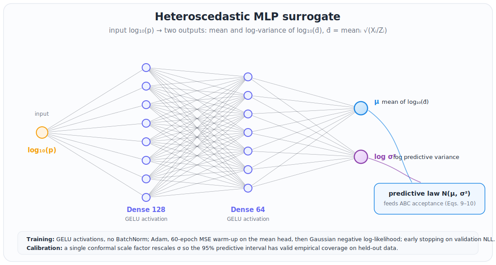
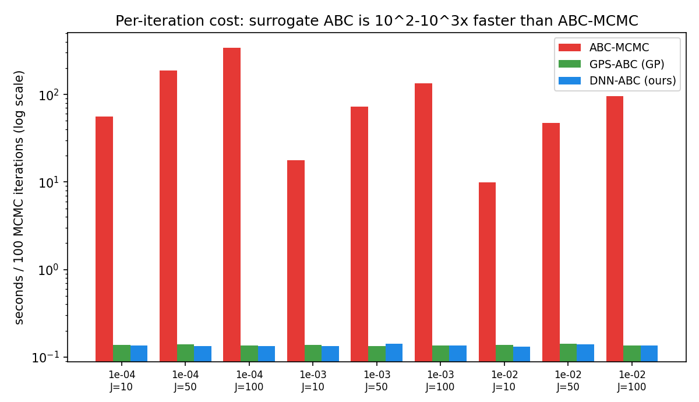

# Mutation-rate estimation: a neural-network surrogate for GPS-ABC

Extends **Lu, Zhu & Wu (2023)**, *"Estimating mutation rates in a Markov branching
process using approximate Bayesian computation"* (Journal of Theoretical Biology
565:111467), by replacing the paper's Gaussian-process surrogate (**GPS-ABC**) with
a **deep neural network** and benchmarking the two head-to-head on the paper's own
1-D constant-mutation-rate task.

## 📄 Full write-up — with all tables and figures

**→ [DNN-ABC: a neural surrogate benchmarked against GPS-ABC](DNN_Prototypes/mutation_rate_1d_surrogate/README.md)**

**Headline result** (1-D benchmark, 40 replicates): the DNN surrogate **matches or
beats GPS-ABC on accuracy in all 9 configurations** (~**21% lower MSE** on average,
up to **62% lower** at `p=1e-2`), with ~**27% tighter** credible intervals and
**calibrated input-dependent uncertainty** the GP cannot provide — at **75×–2567×**
the speed of exact ABC-MCMC.

## Repository layout

| path | contents |
|---|---|
| [`DNN_Prototypes/mutation_rate_1d_surrogate/`](DNN_Prototypes/mutation_rate_1d_surrogate/) | the DNN surrogate + full ABC pipeline (see its README) |
| `RCode/`, `MatlabCode/` | the original two-type MBP simulator + MOM/MLE estimators (paper lineage) |
| `data/slow_data_1D.csv` | exact-simulator ("slow", Algorithm 2) training data |
| `dnn_improvement.md` | design notes / improvement targets |

## Reference

Lu, R., Zhu, H., & Wu, X. (2023). *Estimating mutation rates in a Markov branching
process using approximate Bayesian computation.* Journal of Theoretical Biology,
565, 111467. https://doi.org/10.1016/j.jtbi.2023.111467

*(The published PDF is under Elsevier copyright and is intentionally not included in
this public repository; see the DOI above.)*
